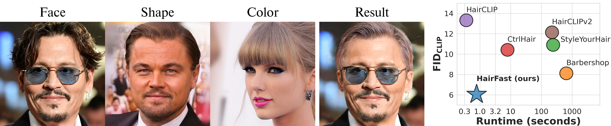

# HairFastGAN: Realistic and Robust Hair Transfer with a Fast Encoder-Based Approach

<a href="https://arxiv.org/abs/2404.01094"></a>
<a href="https://huggingface.co/spaces/AIRI-Institute/HairFastGAN"></a>
<a href="https://colab.research.google.com/#fileId=https://huggingface.co/AIRI-Institute/HairFastGAN/blob/main/notebooks/HairFast_inference.ipynb"></a>
[](./LICENSE)


> Our paper addresses the complex task of transferring a hairstyle from a reference image to an input photo for virtual hair try-on. This task is challenging due to the need to adapt to various photo poses, the sensitivity of hairstyles, and the lack of objective metrics. The current state of the art hairstyle transfer methods use an optimization process for different parts of the approach, making them inexcusably slow. At the same time, faster encoder-based models are of very low quality because they either operate in StyleGAN's W+ space or use other low-dimensional image generators. Additionally, both approaches have a problem with hairstyle transfer when the source pose is very different from the target pose, because they either don't consider the pose at all or deal with it inefficiently. In our paper, we present the HairFast model, which uniquely solves these problems and achieves high resolution, near real-time performance, and superior reconstruction compared to optimization problem-based methods. Our solution includes a new architecture operating in the FS latent space of StyleGAN, an enhanced inpainting approach, and improved encoders for better alignment, color transfer, and a new encoder for post-processing. The effectiveness of our approach is demonstrated on realism metrics after random hairstyle transfer and reconstruction when the original hairstyle is transferred. In the most difficult scenario of transferring both shape and color of a hairstyle from different images, our method performs in less than a second on the Nvidia V100.
> 

<p align="center">
  
  <br>
The proposed HairFast framework allows to edit a hairstyle on an arbitrary photo based on an example from other photos. Here we have an example of how the method works by transferring a hairstyle from one photo and a hair color from another.
</p>

## Updates

- [25/09/2024] 🎉🎉🎉 HairFastGAN has been accepted by [NeurIPS 2024](https://nips.cc/virtual/2024/poster/93397).
- [24/05/2024] 🌟🌟🌟 Release of the [official demo](https://huggingface.co/spaces/AIRI-Institute/HairFastGAN) on Hugging Face 🤗.
- [01/04/2024] 🔥🔥🔥 HairFastGAN release.
  
## Prerequisites
You need following hardware and python version to run our method.
- Linux
- NVIDIA GPU + CUDA CuDNN
- Python 3.10
- PyTorch 1.13.1+

## Installation

* Clone this repo:
```bash
git clone https://github.com/AIRI-Institute/HairFastGAN
cd HairFastGAN
```

* Download all pretrained models:
```bash
git clone https://huggingface.co/AIRI-Institute/HairFastGAN
cd HairFastGAN && git lfs pull && cd ..
mv HairFastGAN/pretrained_models pretrained_models
mv HairFastGAN/input input
rm -rf HairFastGAN
```

* Setting the environment

**Option 1 [recommended]**, install [Poetry](https://python-poetry.org/docs/) and then:
```bash
poetry install
```

**Option 2**, just install the dependencies in your environment:
```bash
pip install -r requirements.txt
```

## Inference
You can use `main.py` to run the method, either for a single run or for a batch of experiments.

* An example of running a single experiment:

```
python main.py --face_path=6.png --shape_path=7.png --color_path=8.png \
    --input_dir=input --result_path=output/result.png
```

* To run the batch version, first create an image triples file (face/shape/color):
```
cat > example.txt << EOF
6.png 7.png 8.png
8.png 4.jpg 5.jpg
EOF
```

And now you can run the method:
```
python main.py --file_path=example.txt --input_dir=input --output_dir=output
```

* You can use HairFast in the code directly:

```python
from hair_swap import HairFast, get_parser

# Init HairFast
hair_fast = HairFast(get_parser().parse_args([]))

# Inference
result = hair_fast(face_img, shape_img, color_img)
```

See the code for input parameters and output formats.

* Alternatively, you can use our [Colab Notebook](https://colab.research.google.com/#fileId=https://huggingface.co/AIRI-Institute/HairFastGAN/blob/main/notebooks/HairFast_inference.ipynb) to prepare the environment, download the code, pretrained weights, and allow you to run experiments with a convenient form.

* You can also try our method on the [Hugging Face demo](https://huggingface.co/spaces/AIRI-Institute/HairFastGAN) 🤗.

## Scripts

There is a list of scripts below, see arguments via --help for details.

| Path                                    | Description 
|:----------------------------------------| :---
| scripts/align_face.py                   | Processing of raw photos for inference
| scripts/fid_metric.py                   | Metrics calculation
| scripts/rotate_gen.py                   | Dataset generation for rotate encoder training
| scripts/blending_gen.py                 | Dataset generation for color encoder training
| scripts/pp_gen.py                       | Dataset generation for refinement encoder training
| scripts/rotate_train.py                 | Rotate encoder training
| scripts/blending_train.py               | Color encoder training
| scripts/pp_train.py                     | Refinement encoder training


## Training
For training, you need to generate a dataset and then run the scripts for training. See the scripts section above.

We use [Weights & Biases](https://wandb.ai/home) to track experiments. Before training, you should put your W&B API key into the `WANDB_KEY` environment variable.

## Method diagram

<p align="center">
  
  <br>
Overview of HairFast: the images first pass through the Pose alignment module, which generates a pose-aligned face mask with the desired hair shape. Then we transfer the desired hairstyle shape using Shape alignment and the desired hair color using Color alignment. In the last step, Refinement alignment returns the lost details of the original image where they are needed.
</p>

## Repository structure

    .
    ├── 📂 datasets                   # Implementation of torch datasets for inference
    ├── 📂 docs                       # Folder with method diagram and teaser
    ├── 📂 models                     # Folder containting all the models
    │   ├── ...
    │   ├── 📄 Embedding.py               # Implementation of Embedding module
    │   ├── 📄 Alignment.py               # Implementation of Pose and Shape alignment modules
    │   ├── 📄 Blending.py                # Implementation of Color and Refinement alignment modules
    │   ├── 📄 Encoders.py                # Implementation of encoder architectures
    │   └── 📄 Net.py                     # Implementation of basic models
    │
    ├── 📂 losses                     # Folder containing various loss criterias for training
    ├── 📂 scripts                    # Folder with various scripts
    ├── 📂 utils                      # Folder with utility functions
    │
    ├── 📜 poetry.lock                # Records exact dependency versions.
    ├── 📜 pyproject.toml             # Poetry configuration for dependencies.
    ├── 📜 requirements.txt           # Lists required Python packages.
    ├── 📄 hair_swap.py               # Implementation of the HairFast main class
    └── 📄 main.py                    # Script for inference

## References & Acknowledgments

The repository was started from [Barbershop](https://github.com/ZPdesu/Barbershop).

The code [CtrlHair](https://github.com/XuyangGuo/CtrlHair), [SEAN](https://github.com/ZPdesu/SEAN), [HairCLIP](https://github.com/wty-ustc/HairCLIP), [FSE](https://github.com/InterDigitalInc/FeatureStyleEncoder), [E4E](https://github.com/omertov/encoder4editing) and [STAR](https://github.com/ZhenglinZhou/STAR) was also used.

## Citation

If you use this code for your research, please cite our paper:
```
@article{nikolaev2024hairfastgan,
  title={HairFastGAN: Realistic and Robust Hair Transfer with a Fast Encoder-Based Approach},
  author={Nikolaev, Maxim and Kuznetsov, Mikhail and Vetrov, Dmitry and Alanov, Aibek},
  journal={arXiv preprint arXiv:2404.01094},
  year={2024}
}
```
